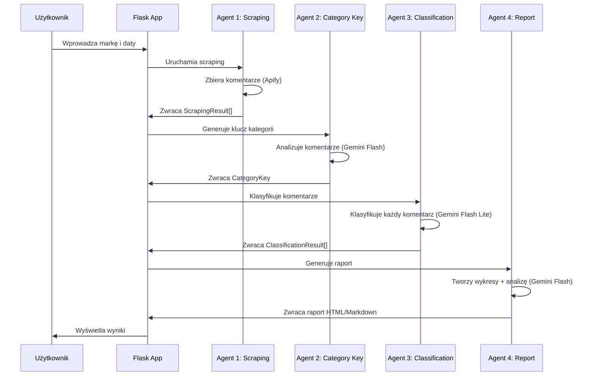
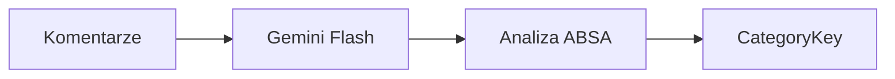
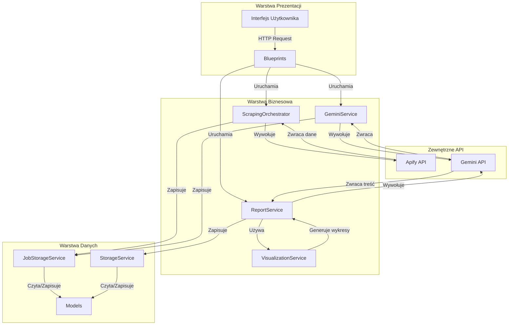

# Dokumentacja Projektowa Architektury Modularnego Systemu Agentów

## Spis treści

1. [Wprowadzenie](#wprowadzenie)
2. [Architektura ogólna](#architektura-ogólna)
3. [Architektura modułowa](#architektura-modułowa)
4. [System agentów](#system-agentów)
5. [Przepływ danych](#przepływ-danych)
6. [Decyzje projektowe](#decyzje-projektowe)
7. [Rozszerzalność](#rozszerzalność)

---

## Wprowadzenie

### Cel dokumentu

Niniejsza dokumentacja opisuje architekturę modularnego systemu agentów **SocialPure Prototype** - aplikacji do monitorowania i analizy komentarzy z mediów społecznych. Dokument ma na celu:

- Przedstawienie ogólnej architektury systemu
- Opisanie roli i odpowiedzialności każdego modułu
- Wyjaśnienie współpracy między agentami
- Umożliwienie zrozumienia przepływu danych
- Ułatwienie rozwijania i utrzymania systemu

### Zakres systemu

SocialPure Prototype to system składający się z czterech głównych agentów AI, które współpracują w celu:

1. **Scrapingu** komentarzy z Facebook
2. **Generowania** inteligentnego klucza kategorii (ABSA)
3. **Klasyfikacji** komentarzy do odpowiednich kategorii
4. **Generowania** szczegółowych raportów analitycznych

### Technologie

- **Backend**: Flask 3.0+ (Python)
- **AI/ML**: Google Gemini API (2.5 Flash / Flash Lite)
- **Scraping**: Apify Platform
- **Wizualizacje**: Matplotlib
- **Dane**: JSON (lokalne przechowywanie)
- **Frontend**: HTML/CSS/JavaScript (Chart.js)

---

## Architektura ogólna

### Wysokopoziomowy przegląd

System opiera się na architekturze modułowej z wyraźnym podziałem odpowiedzialności:

```
┌─────────────────────────────────────────────────────────────┐
│                    Flask Application                        │
│                      (app.py)                              │
└───────────────────────┬───────────────────────────────────┘
                        │
        ┌───────────────┼───────────────┐
        │               │               │
┌───────▼──────┐  ┌──────▼──────┐  ┌────▼──────┐
│  Blueprints │  │   Models    │  │ Services  │
│  (Routes)   │  │  (Data)     │  │ (Agents)  │
└─────────────┘  └────────────┘  └───────────┘
```

### Przepływ pracy użytkownika



---

## Architektura modułowa

### Struktura katalogów

```
SocialPure_prototype/
├── app.py                    # Entry point Flask
├── config.py                 # Konfiguracja (env vars)
│
├── models/                   # Modele danych (Data Layer)
│   ├── scraping_job.py      # Główny model zadania
│   ├── scraping_result.py   # Wynik scrapingu
│   ├── category_key.py      # Klucz kategorii (ABSA)
│   └── classification_result.py  # Wynik klasyfikacji
│
├── services/                 # Logika biznesowa (Business Layer)
│   ├── scraping_orchestrator.py      # Agent 1: Orchestrator
│   ├── apify_service.py              # Integracja Apify
│   ├── facebook_scraper.py           # Scraper Facebook
│   ├── facebook_search.py            # Wyszukiwanie FB
│   ├── query_generator.py            # Generowanie zapytań
│   ├── gemini_service.py             # Integracja Gemini
│   ├── report_service.py             # Agent 4: Raporty
│   ├── visualization_service.py      # Wykresy
│   ├── job_storage.py                # Przechowywanie zadań
│   └── storage_service.py            # Zapisywanie do JSON
│
├── blueprints/               # Warstwa prezentacji (Presentation Layer)
│   ├── scraping.py           # Główne endpointy
│   └── api.py                # API endpoints
│
└── utils/                    # Narzędzia pomocnicze
    ├── helpers.py            # Funkcje pomocnicze
    └── validators.py         # Walidacja danych
```

### Warstwy architektury

#### 1. Warstwa prezentacji (Presentation Layer)

**Moduł**: `blueprints/`

**Odpowiedzialność**:
- Obsługa żądań HTTP
- Walidacja danych wejściowych
- Renderowanie szablonów HTML
- Koordynacja workflow (uruchamianie agentów w tle)

**Główne komponenty**:
- `scraping.py` - endpointy dla scrapingu i klasyfikacji
- `api.py` - REST API endpoints

**Przykład użycia**:
```python
@scraping_bp.route('/scrape', methods=['POST'])
def start_scraping():
    # Walidacja danych
    # Utworzenie ScrapingJob
    # Uruchomienie Agent 1 w tle
    # Zwrócenie job_id
```

#### 2. Warstwa biznesowa (Business Layer)

**Moduł**: `services/`

**Odpowiedzialność**:
- Implementacja logiki biznesowej
- Koordynacja agentów
- Integracja z zewnętrznymi API
- Przetwarzanie danych

**Kluczowe serwisy**:
- **Orchestrators**: Koordynują przepływ pracy
- **External Services**: Integracje z Apify i Gemini
- **Storage Services**: Zarządzanie danymi

#### 3. Warstwa danych (Data Layer)

**Moduł**: `models/`

**Odpowiedzialność**:
- Definicja struktur danych
- Walidacja danych
- Serializacja/deserializacja

**Główne modele**:
- `ScrapingJob` - główny model zadania (zawiera wszystkie dane)
- `ScrapingResult` - pojedynczy wynik scrapingu
- `CategoryKey` - klucz kategorii wygenerowany przez Agent 2
- `ClassificationResult` - wynik klasyfikacji komentarza

---

## System agentów

System składa się z **czterech agentów AI**, każdy odpowiedzialny za konkretny etap przetwarzania:

### Agent 1: Scraping Orchestrator

**Lokalizacja**: `services/scraping_orchestrator.py`

**Cel**: Zbieranie komentarzy z Facebook

**Technologie**:
- Apify Platform (`apify/facebook-posts-scraper`)
- Google Search (do znajdowania URL-i)

**Przepływ pracy**:

```mermaid
graph LR
    A[Query Generator] --> B[Facebook Search]
    B --> C[URL Collection]
    C --> D[Apify Scraper]
    D --> E[ScrapingResult[]]
```

**Kroki**:
1. **Generowanie zapytań** (`QueryGeneratorService`)
   - Tworzy różnorodne zapytania wyszukiwania dla marki
   - Przykład: "Politechnika Śląska", "Politechnika Śląska opinie", etc.

2. **Wyszukiwanie URL-i** (`FacebookSearchService`)
   - Używa Apify Google Search do znajdowania wzmianek na Facebook
   - Kategoryzuje: strony, grupy, wydarzenia, wzmianki

3. **Scraping komentarzy** (`FacebookScraperService`)
   - Uruchamia Apify Actor dla każdego URL
   - Zbiera komentarze z postów
   - Priorytetyzacja: wzmianki > strony > grupy > wydarzenia

**Dane wejściowe**:
- `brand_name: str` - nazwa marki/organizacji

**Dane wyjściowe**:
- `List[ScrapingResult]` - lista komentarzy z metadanymi

**Model danych**:
```python
@dataclass
class ScrapingResult:
    text: str              # Treść komentarza
    author: str            # Autor
    url: str               # URL posta
    source_type: str       # Typ źródła (post/group/event)
    timestamp: datetime     # Data publikacji
```

---

### Agent 2: Category Key Generator

**Lokalizacja**: `services/gemini_service.py` → `generate_category_key()`

**Cel**: Generowanie inteligentnego klucza kategorii metodą ABSA (Aspect-Based Sentiment Analysis)

**Technologie**:
- Google Gemini 2.5 Flash
- Prompt engineering (ABSA prompt)

**Przepływ pracy**:



**Proces**:
1. Przygotowanie danych: ekstrakcja tekstów komentarzy
2. Wywołanie Gemini z promptem ABSA
3. Parsowanie odpowiedzi JSON
4. Utworzenie obiektu `CategoryKey`

**Prompt ABSA**:
```
Jesteś analitykiem marketingowym badającym opinie klientów.
Twoim zadaniem jest stworzenie klucza do Analizy Aspektowej Sentymentu (ABSA).
Skup się wyłącznie na identyfikacji konkretnych ASPEKTÓW (cech, atrybutów).
```

**Dane wejściowe**:
- `comments: List[str]` - lista tekstów komentarzy
- `brand_name: str` - nazwa marki

**Dane wyjściowe**:
- `CategoryKey` - obiekt zawierający listę kategorii z definicjami

**Model danych**:
```python
@dataclass
class CategoryKey:
    job_id: str
    categories: List[Dict[str, str]]  # [{"aspekt": "...", "definicja": "..."}]
    prompt_type: str = "ABSA"
```

**Przykład wygenerowanych kategorii**:
```json
[
  {
    "aspekt": "Jakość nauczania",
    "definicja": "Opinie dotyczące poziomu edukacji i kompetencji wykładowców"
  },
  {
    "aspekt": "Infrastruktura",
    "definicja": "Opinie dotyczące budynków, laboratoriów, bibliotek"
  }
]
```

---

### Agent 3: Classification Orchestrator

**Lokalizacja**: `blueprints/scraping.py` → `run_classification_all()`

**Cel**: Klasyfikacja każdego komentarza do odpowiedniej kategorii i określenie sentymentu

**Technologie**:
- Google Gemini 2.5 Flash Lite (szybszy, tańszy model)
- Batch processing dla optymalizacji

**Przepływ pracy**:

```mermaid
graph LR
    A[ScrapingResult[]] --> B[Dla każdego komentarza]
    B --> C[Gemini Flash Lite]
    C --> D[Klasyfikacja]
    D --> E[ClassificationResult]
```

**Proces**:
1. Iteracja przez wszystkie `ScrapingResult`
2. Dla każdego komentarza:
   - Przygotowanie promptu z kluczem kategorii
   - Wywołanie Gemini Flash Lite
   - Parsowanie odpowiedzi (kategoria + sentiment)
   - Utworzenie `ClassificationResult`
3. Zapis wyników do `ScrapingJob.classification_results`

**Prompt klasyfikacji**:
```
Sklasyfikuj poniższy komentarz do jednej z kategorii:
[lista kategorii z definicjami]

Określ również sentiment: pozytywny/negatywny/neutralny
```

**Dane wejściowe**:
- `ScrapingResult[]` - lista komentarzy
- `CategoryKey` - klucz kategorii wygenerowany przez Agent 2

**Dane wyjściowe**:
- `Dict[int, ClassificationResult]` - mapa indeks → wynik klasyfikacji

**Model danych**:
```python
@dataclass
class ClassificationResult:
    comment_text: str
    category: str              # Nazwa kategorii
    sentiment: str             # "pozytywny"/"negatywny"/"neutralny"
    comment_index: int
    classified_at: datetime
```

**Optymalizacja**:
- Użycie Flash Lite zamiast Flash (szybsze, tańsze)
- Przetwarzanie sekwencyjne (można zoptymalizować do batch)

---

### Agent 4: Report Generator

**Lokalizacja**: `services/report_service.py`

**Cel**: Generowanie szczegółowych raportów analitycznych z wizualizacjami

**Technologie**:
- Google Gemini 2.5 Flash (do generowania treści)
- Matplotlib (do wykresów)
- Markdown → HTML/DOCX

**Przepływ pracy**:

```mermaid
graph LR
    A[ClassificationResult[]] --> B[VisualizationService]
    B --> C[Wykresy PNG]
    A --> D[Statystyki]
    D --> E[Gemini Flash]
    E --> F[Treść raportu]
    C --> G[Osadzenie wykresów]
    F --> G
    G --> H[Raport HTML/DOCX]
```

**Proces**:
1. **Generowanie wykresów** (`VisualizationService`)
   - Wykres słupkowy: kategorie × sentiment
   - Wykres kołowy: rozkład sentymentu
   - Wykres kołowy: rozkład kategorii

2. **Obliczanie statystyk**
   - Liczba komentarzy
   - Rozkład sentymentu (procenty)
   - Rozkład kategorii
   - Top kategorie

3. **Generowanie treści przez Gemini**
   - Prompt z danymi statystycznymi
   - Generowanie sekcji: podsumowanie, analiza, wnioski, rekomendacje

4. **Finalizacja raportu**
   - Osadzenie wykresów w Markdown
   - Konwersja do HTML (z base64 wykresów)
   - Eksport do DOCX

**Dane wejściowe**:
- `List[ClassificationResult]` - wyniki klasyfikacji
- `CategoryKey` - klucz kategorii
- `brand_name: str`
- `start_date, end_date: str`

**Dane wyjściowe**:
- `report_{job_id}.html` - raport HTML
- `report_{job_id}.md` - raport Markdown
- `report_{job_id}.docx` - raport DOCX (na żądanie)

**Struktura raportu**:
1. Podsumowanie wykonawcze (Executive Summary)
2. Analiza statystyczna (z wykresami)
3. Analiza kategorii (dla top 5 kategorii)
4. Wnioski i rekomendacje

---

## Przepływ danych

### Diagram przepływu danych



### Format danych między modułami

#### 1. ScrapingJob (Główny model)

```python
@dataclass
class ScrapingJob:
    job_id: str
    brand_name: str
    start_date: str
    end_date: str
    status: str  # "pending"/"scraping"/"classifying"/"completed"/"failed"
    progress: float  # 0.0 - 1.0
    scraping_results: List[ScrapingResult]
    category_key: Optional[CategoryKey]
    classification_results: Dict[int, dict]  # {index: {category, sentiment}}
```

#### 2. Przechowywanie danych

**W pamięci** (`JobStorageService`):
- Przechowuje aktywne zadania w słowniku `{job_id: ScrapingJob}`
- Szybki dostęp do aktualnych zadań

**W plikach** (`StorageService`):
- Zapis do `data/job_{job_id}.json`
- Trwałe przechowywanie po zakończeniu zadania
- Raporty w `data/reports/report_{job_id}.html`

#### 3. Komunikacja między agentami

**Agent 1 → Agent 2**:
- Przekazuje: `List[ScrapingResult]`
- Otrzymuje: `CategoryKey`

**Agent 2 → Agent 3**:
- Przekazuje: `CategoryKey` + `List[ScrapingResult]`
- Otrzymuje: `Dict[int, ClassificationResult]`

**Agent 3 → Agent 4**:
- Przekazuje: `List[ClassificationResult]` + `CategoryKey`
- Otrzymuje: Raport HTML/Markdown

---

## Decyzje projektowe

### 1. Dlaczego modułowa architektura?

**Decyzja**: Podział na moduły (`models/`, `services/`, `blueprints/`)

**Uzasadnienie**:
- **Separacja odpowiedzialności**: Każdy moduł ma jasno określoną rolę
- **Łatwość testowania**: Moduły można testować niezależnie
- **Rozszerzalność**: Łatwe dodawanie nowych funkcji bez modyfikacji istniejących
- **Czytelność kodu**: Jasna struktura ułatwia nawigację

**Alternatywy rozważane**:
- Monolityczna struktura (odrzucona - zbyt skomplikowana)
- Mikroserwisy (odrzucona - overkill dla prototypu)

### 2. Dlaczego różne modele Gemini dla różnych zadań?

**Decyzja**: 
- Agent 2 i 4: Gemini 2.5 Flash (bardziej zaawansowane zadania)
- Agent 3: Gemini 2.5 Flash Lite (klasyfikacja)

**Uzasadnienie**:
- **Koszt**: Flash Lite jest tańszy - Agent 3 wykonuje wiele wywołań (dla każdego komentarza)
- **Szybkość**: Flash Lite jest szybszy - ważne dla UX podczas klasyfikacji
- **Jakość**: Flash wystarczający dla generowania kategorii i raportów (mniej wywołań, ale bardziej złożone)

**Alternatywy rozważane**:
- Wszystkie agenty używają Flash (odrzucona - zbyt drogie)
- Wszystkie agenty używają Flash Lite (odrzucona - gorsza jakość raportów)

### 3. Dlaczego Flask Blueprints?

**Decyzja**: Użycie Flask Blueprints zamiast jednego pliku routes

**Uzasadnienie**:
- **Organizacja**: Logiczne grupowanie endpointów
- **Skalowalność**: Łatwe dodawanie nowych modułów (np. `blueprints/api.py`)
- **Modularność**: Blueprint można łatwo wyłączyć/włączyć

### 4. Dlaczego background jobs dla długotrwałych operacji?

**Decyzja**: Użycie `ThreadPoolExecutor` dla scrapingu i klasyfikacji

**Uzasadnienie**:
- **UX**: Użytkownik nie czeka na odpowiedź HTTP
- **Timeouty**: Długotrwałe operacje mogą przekroczyć timeout HTTP
- **Progres**: Możliwość śledzenia postępu przez polling

**Implementacja**:
```python
executor = ThreadPoolExecutor(max_workers=2)
executor.submit(run_scraping_and_generate_key, job_id, brand_name)
```

**Alternatywy rozważane**:
- Synchronous processing (odrzucona - złe UX)
- Celery/Redis (odrzucona - zbyt skomplikowane dla prototypu)

### 5. Dlaczego lokalne przechowywanie (JSON) zamiast bazy danych?

**Decyzja**: Przechowywanie danych w plikach JSON

**Uzasadnienie**:
- **Prostota**: Brak potrzeby konfiguracji bazy danych
- **Prototyp**: Wystarczające dla wersji prototypowej
- **Przenośność**: Łatwe backup i przenoszenie danych

**Wady**:
- Brak transakcji
- Problemy z równoczesnym dostępem
- Skalowalność ograniczona

**Plan na przyszłość**: Migracja do PostgreSQL/MongoDB dla produkcji

---

## Rozszerzalność

### Jak dodać nowego agenta?

**Krok 1**: Utwórz nowy serwis w `services/`

```python
# services/new_agent_service.py
class NewAgentService:
    def __init__(self):
        self.gemini_service = GeminiService()
        self.logger = LoggerService()
    
    def execute(self, input_data):
        # Logika agenta
        pass
```

**Krok 2**: Dodaj endpoint w `blueprints/scraping.py`

```python
@scraping_bp.route('/new-agent/<job_id>', methods=['POST'])
def run_new_agent(job_id):
    job = job_storage.get(job_id)
    new_agent = NewAgentService()
    executor.submit(new_agent.execute, job)
    return jsonify({"success": True})
```

**Krok 3**: Zintegruj z workflow (opcjonalnie)

```python
# W run_scraping_and_generate_key lub nowym orchestratorze
result = new_agent.execute(job)
job.new_agent_result = result
```

### Jak dodać nowy format raportu?

**Krok 1**: Dodaj metodę w `ReportService`

```python
def export_to_new_format(self, markdown_content, job_id):
    # Konwersja do nowego formatu
    pass
```

**Krok 2**: Dodaj endpoint

```python
@scraping_bp.route('/report/<job_id>/download')
def download_report(job_id):
    format_type = request.args.get('format')
    if format_type == 'new_format':
        return report_service.export_to_new_format(...)
```

### Jak dodać nowe źródło danych?

**Krok 1**: Utwórz nowy serwis scrapingu

```python
# services/twitter_scraper.py
class TwitterScraperService:
    def scrape(self, brand_name):
        # Logika scrapingu Twitter
        pass
```

**Krok 2**: Zintegruj z `ScrapingOrchestrator`

```python
# W scraping_orchestrator.py
def execute_scraping_job(self, brand_name, sources=['facebook', 'twitter']):
    results = []
    if 'facebook' in sources:
        results.extend(self.facebook_scraper.scrape(brand_name))
    if 'twitter' in sources:
        results.extend(self.twitter_scraper.scrape(brand_name))
    return results
```

### Jak zmienić model AI?

**Krok 1**: Zmień model w `GeminiService`

```python
# W gemini_service.py
self.new_model = genai.GenerativeModel('gemini-2.0-pro')
```

**Krok 2**: Użyj nowego modelu w odpowiednim agencie

```python
# W metodzie agenta
response = self.gemini_service.new_model.generate_content(prompt)
```

---

## Podsumowanie

SocialPure Prototype wykorzystuje **modularną architekturę agentów**, gdzie każdy agent jest odpowiedzialny za konkretny etap przetwarzania danych. System jest zaprojektowany z myślą o:

- **Modularności**: Łatwe dodawanie nowych funkcji
- **Skalowalności**: Możliwość rozbudowy o nowe źródła danych
- **Utrzymywalności**: Czytelna struktura kodu
- **Rozszerzalności**: Proste dodawanie nowych agentów

Architektura pozwala na niezależne rozwijanie poszczególnych modułów, co ułatwia pracę zespołową i testowanie.

---

**Wersja dokumentacji**: 1.0  
**Data ostatniej aktualizacji**: 2025-01-XX  
**Autor**: SocialPure Development Team

